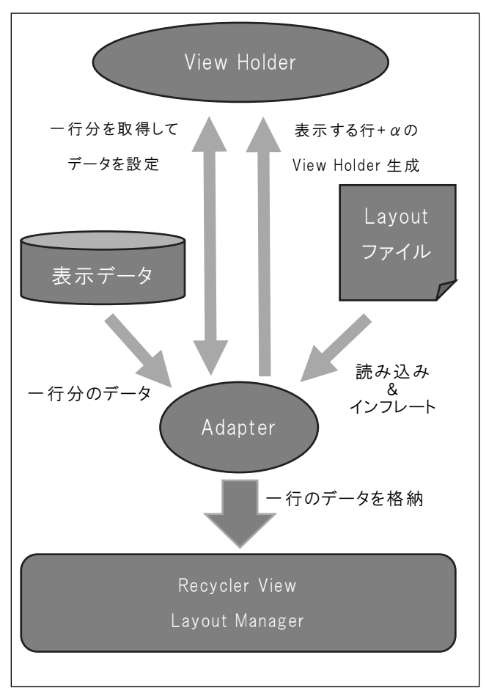
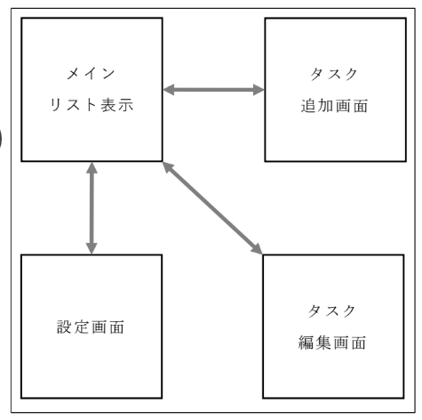
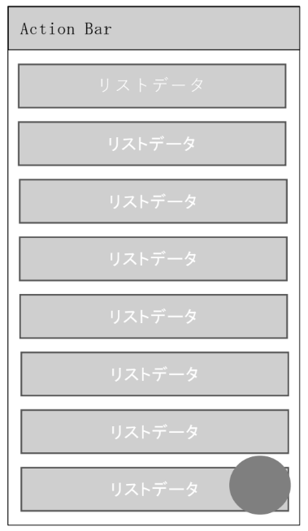
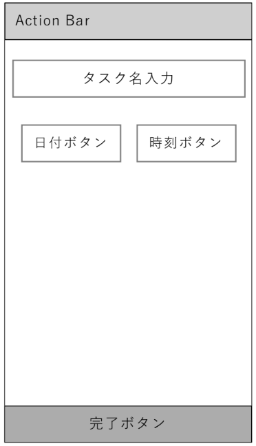
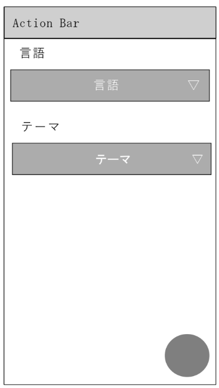
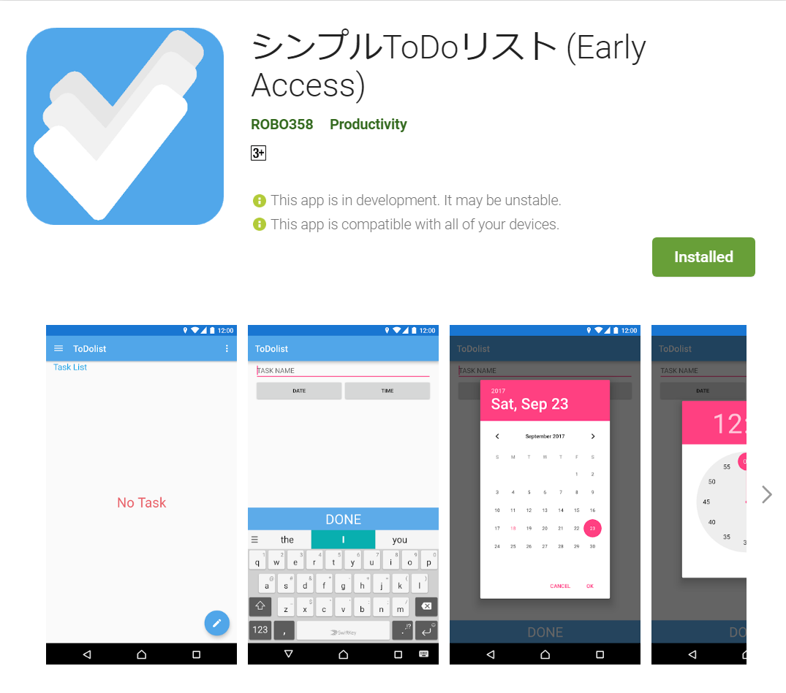
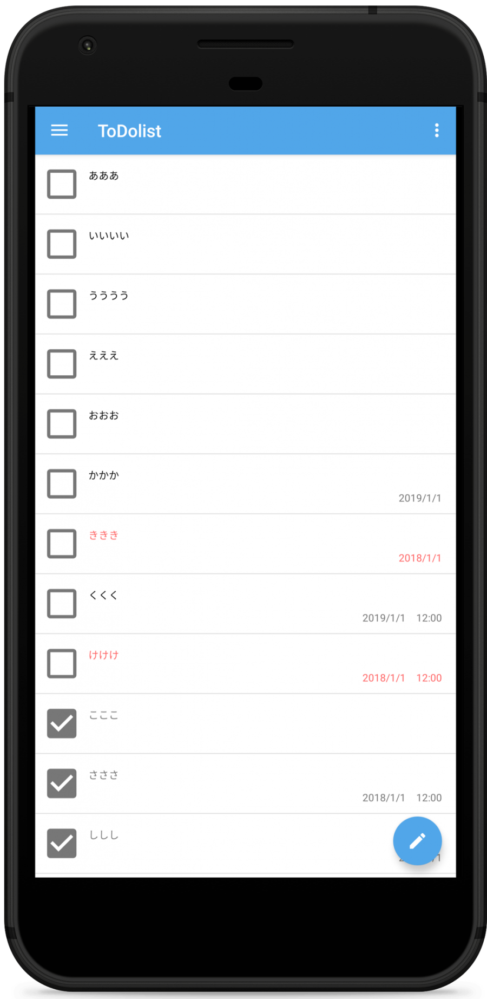
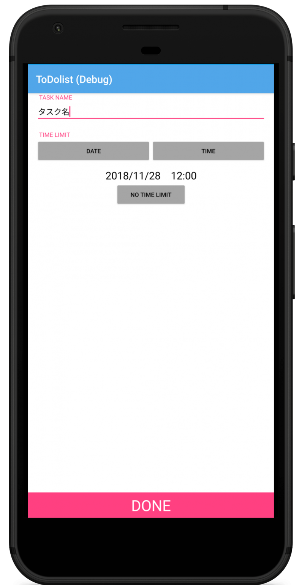
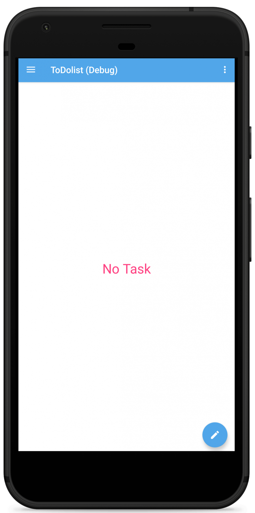
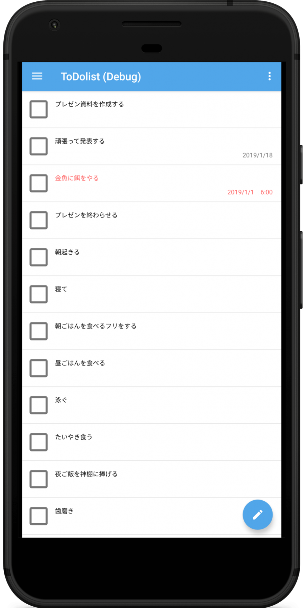

自身が高校で生徒会本部役員をやっていたこともあり、予定の管理を行うことが必要であった。そのため、タスク(予定)管理が可能なAndroidアプリケーションの開発を行った。

高校で情報工学を専攻していたこともあり、講義の時間を使いデザインや内部処理など含め一年かけ完成度を上げた。

---

## 使用した言語・技術

IDEはAndroidStudioを使った。
Andoroidアプリケーションの開発はまだまだ慣れていなかったためKotlinではなく参考文献が豊富なJavaを用いて開発をした。

- SQLite(RDBMS)
- RecyclerView
- Picker(Dialog)
- Notification
- Material Design(マテリアル デザイン)

タスクのデータはSQLiteを用いてRDBで管理をした。
このタスクを表示はRecyclerViewを用いてリスト表示をし、区切り線やチェックボックスなどの装飾を行った。
また、同様にリスト表示を行えるListViewと異なり、リスト内容が動的に変化した際にアニメーションを追加できるなど動的処理が出来るため、今回採用した。
RecyclerViewはクリック時のイベント(ItemClickListener)がデフォルトで存在しないためクリックイベントを1から作成した。

### RecyclerView

以下の図のような働きをする。

> ***RecyclerView の働き**  
> レポート作成時に作成したもののためモノクロで申し訳ない*

---

## 画面遷移

> ***画面遷移の概要**  
> レポート作成時に作成したもののためモノクロで申し訳ない*

### メイン画面

> ***メイン画面の概要**  
> レポート作成時に作成したもののためモノクロで申し訳ない*

メイン画面ではタスク一覧を表示し、既存のタスクをクリックすることでタスクの編集画面へ遷移する。

### タスク追加画面

> ***タスク追加画面の概要**  
> レポート作成時に作成したもののためモノクロで申し訳ない*

タスク追加画面ではメイン画面右下のFloatingActionButtonをクリックすることで開くことが出来る。また左端からスワイプすることで開くNavigationDrawerからも開く事ができる。タスクには日付と時刻を設定できるようになっており。この時刻・日付になった際に通知が表示されるようになっている。タスク編集時にもこのページが開くようになっている。

### 設定画面

> ***設定画面の概要**  
> レポート作成時に作成したもののためモノクロで申し訳ない*

設定画面では言語・テーマの変更が行える。
言語は、開発時では英語・日本語の変更を行えるようになっている。
テーマは、Lightテーマ・Darkテーマを切り替えることが出来る。

---

## 配信について

作成したアプリケーションはGooglePlayの配信に適した形で制作しており、実際に配信を行った。
本配信ではなくテストプレイとして配信を行った。

友人何名かにテストを頼み最終的なデザイン・機能となった。
この際出てきたバグとして

- 一部端末でのアイコンの表示がおかしい(ラウンドアイコンの非対応が原因)
- ノッチ付き端末にてレイアウト崩れ(NavigationDrawerのオプション設定ミス)
- タスク表示画面での文字見切れ(端末固有フォントの考慮不足)
- アプリケーションアップデート時のデータベース不適合

以上が発生してしまった。

個人の端末に最適化しすぎたことで主に他端末でのレイアウト崩れが多発してしまった。

## 実際の画面

| | | | |
|---|---|---|---|
|  |  |  |  |

*実際の画面(モックアップはめ込み画像)*

---

## まとめ・感想

今回は1年近くかけ自端末以外への対応や各機能の安定化を含め様々な機能の追加を行ってきた。
ここまで深く1つのソフトウェアに向かい合う1年間はなかったため良い経験となったなと感じている。

最終的にEarly AccessではあるがGoogle Play Storeでの配信ができたのも良かったと思っている。
