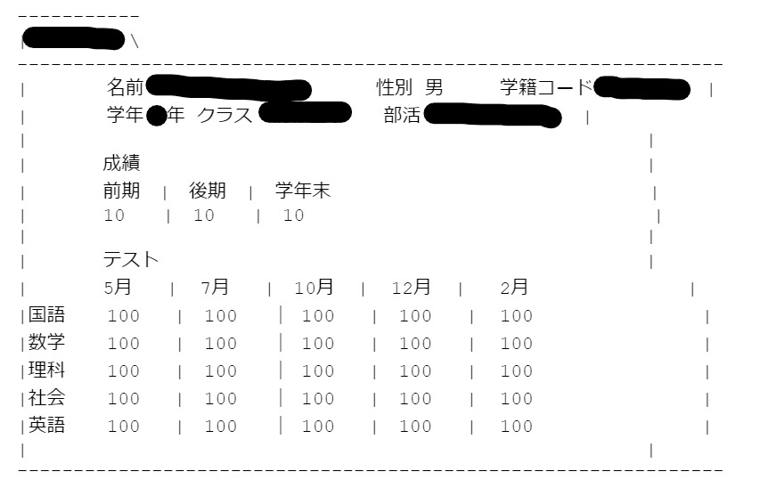

高校生の頃に作成したシステムである。
6人ほどのチームで一つの成績管理を行うシステムを作成するという課題で作成したものである。RDBMSであるOracle Databaseを用いたRDB(リレーショナルデータベース)の管理、CUIでの成績登録・参照等が可能なシステムを作成した。本システムについてはLinux(Red Hat)環境を用いて開発を行っている。

本記事には課題であったこと及び他の開発者がおり確認が取れていないことからシステムのスクリーンショット等は掲載をしない。
見づらくなってしまうがご理解いただきたい。

---

## 使用した言語・技術

IDEは使用せず、テキストエディタとしてVimを使用した。  
C言語については GNU Compiler Collection(gcc) を用いてコンパイルしている。

- C言語
- C Shell
- Oracle database(RDBMS)

初期計画では、  
C言語によって画面表示の内容の区別(誰を表示するかなど)を行い、  
C Shellによって実際の描画及びSQL文の実行を行うとした。  
しかし、結果としてこれらの役割は区別できずチーム内で言語が複雑に絡み合い混在する事となってしまった。そのため、画面表記をC Shellが担当。また、その反対も存在することとなった。

---

## デザイン

このシステムではCUIを用いていることもあり操作しづらく見づらいという難点が生じてしまうと懸念されていた。そのため、マニラフォルダ-をモチーフとしたUIをデザインすることで軽減しようとした。
以下がデザイン例である。

**成績管理システムにおけるデザイン見本**
> この画像では文字コードの違いより右列にずれが生じているが本番環境では正常に動作した

このデザインはすべてのページにおいて統一されており、左上のインデックス部分に現在の表示項目についてを表記するようにした。  
画面遷移のようなUIを目指し、毎回画面上の表示をリセットして新たなページに上記のような画面を表示するようにした。

---

## 画面遷移

メニュー画面を起点とし、
- 生徒一覧
- 生徒選択画面
- 生徒詳細(一人)
- 教員一覧
- 部活動一覧
- 成績順生徒一覧(成績指定可能)
- 生徒情報更新
- 教員情報更新
- 全データランダム生成(ダミーデータ生成)
- 印刷機能

を搭載した。  
冒頭に記したとおり課題として成績管理システムの構築が出されたため、ダミーデータを登録することとなっていた。そのため、このダミーデータを自動生成するシステムを構築した。この課題ではダミーデータの自動生成及び登録・更新をはじめとして、生徒選択、生徒詳細、成績順生徒一覧、生徒(教員)情報更新、印刷機能を主に担当した。  
今回は、全データランダム生成についてまとめる。

---

## 全データランダム生成

ダミーデータ生成は生徒の情報(名前・性別・学籍コード・学年・クラス・所属部活・成績・各教科、各期テスト結果)と教員情報(名前・性別・教員コード・担当クラス・担当部活)を更新するものである。

### 生徒データ生成

まずは生徒のデータ生成から説明をしていく。

生徒の学籍コードは学年・クラスとの紐付けがされているため、学籍コードを順番に名前・性別・所属部活・成績・テスト結果を生成することとなる。(本システムは学籍コードを実際に学校で使用されていた仕様を引き継いでいるため詳細については念の為省く)

名前の生成は「[疑似個人情報データ生成サービス](https://hogehoge.tk/personal/)」を使用させていただいた。このサービスにて姓名をランダム生成し、全データから姓名それぞれをランダムに抽出し結合することで名前の生成を行った。この際、5千以上の元データではあるが万が一同姓同名が発生しても学籍コード(ID)管理を行っているため訂正は行わなかった。

性別は男・女・その他の3種からランダムに選択した。  
同じように部活についてもランダム選択を行った。

テスト結果は基準点を中心として適度に分布が起きるようにした。  
この結果をもとにテスト100%で成績を計算している。

### 教員データ生成

教員のデータ生成は生徒よりも単純である。

生徒データ同様に名前・性別を生成し、生徒データでの所属部活のように所属クラス・所属部活の生成を行った。

---

## まとめ・感想

今回は、小規模ではあったものの複数名でのシステム開発だったため進捗状況等を確認しつつ進めていくのが大変であった。しかし、チームであったからそれぞれのプログラムの仕様を詰めて計画し大幅に初期計画から逸脱することがなく良かった。  
言語ごとの役割の統一などまだまだ計画を練れた点が多くあったため、これらを今後のプロジェクトに活かしていきたい。
